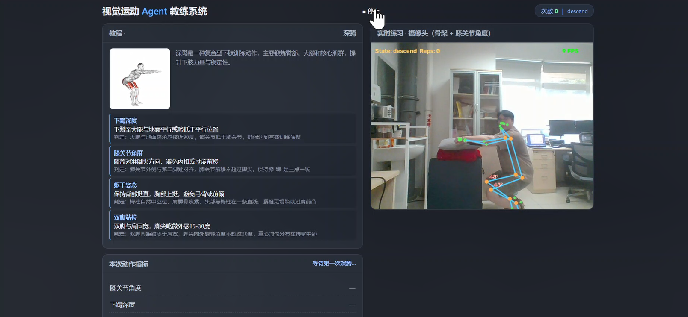
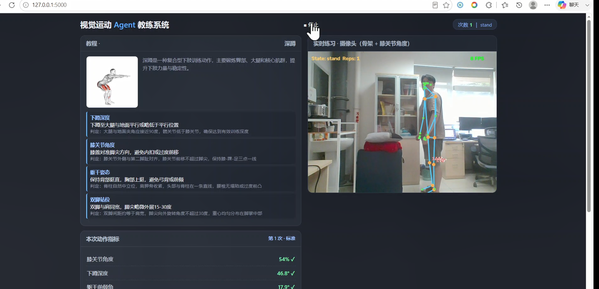
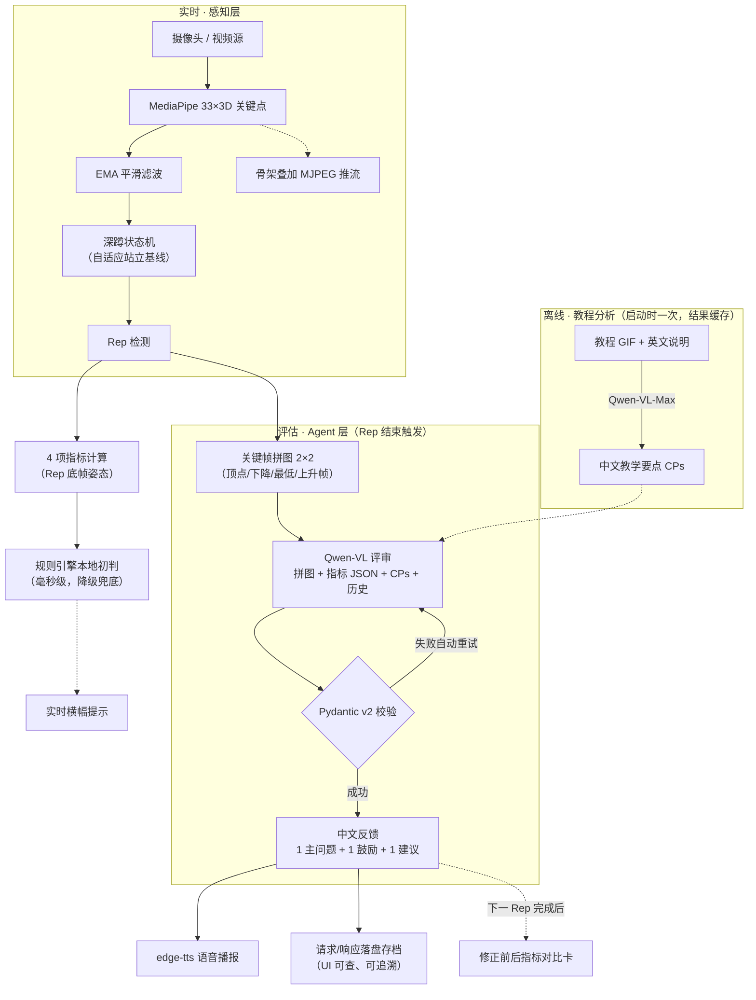

# 视觉运动 Agent 系统 · AI 深蹲教练

基于 **MediaPipe 姿态估计 + Qwen-VL 视觉大模型** 的实时动作教练系统：看教程 → 实时练习 → VLM 纠错 → 调整后验证的完整闭环。

[](https://github.com/fangkai00/pose-case/actions/workflows/ci.yml)


## 效果演示

| 实时骨架 + 状态机 + 指标 | VLM 反馈卡 + 修正前后对比 |
|:---:|:---:|
|  |  |
| 左侧教程要点 / 右侧实时画面与骨架，横幅提示当前动作状态与指标 | 每个 Rep 的 VLM 评审反馈卡，及修正前后指标对比卡 |

## 系统架构



## 核心亮点

- **完整 Agent 闭环**：教程要点提取 → 实时感知 → Rep 级评估 → VLM 评审 → TTS 播报 → 修正验证，非单点 Demo
- **鲁棒的深蹲状态机**：自适应站立基线（`min(160°, 个人基线−10°)`），微屈膝/浅蹲体型均可正确检测；动作中人体丢失 ≤1s 冻结不误丢
- **4 个可解释指标**：最低点膝角、下蹲深度（髋降幅/腿长）、躯干前倾角、左右对称性，均基于 rep 底帧 3D 姿态计算
- **VLM 结构化输出**：Pydantic v2 校验 Qwen-VL 返回，失败自动重试；每次评审的原始请求/响应落盘存档，UI 可查、可追溯
- **工程化降级设计**：VLM/TTS 均为云端异步调用，失败或无 Key 时自动降级为本地规则引擎，摄像头画面永不阻塞

## 快速开始

```bash
# 1. 安装依赖
pip install -r requirements.txt

# 2. 配置 API Key（复制模板并填入百炼 Key，https://bailian.console.aliyun.com/）
copy config.example.py config.py   # Linux/macOS: cp

# 3. 启动
python app.py                          # 摄像头模式
python app.py --video test_squat.mp4   # 视频回放模式（无摄像头可演示）
# 浏览器打开 http://127.0.0.1:5000
```

> 姿态模型 `models/pose_landmarker_lite.task` 与教程数据集 `exercises-dataset-main/` 均已随仓库提供，开箱即用。

## 目录结构

```
├── app.py                  # Flask 入口：采集线程 + MJPEG 推流 + 事件分发
├── config.py               # 全局配置（阈值/模型/Key，从模板复制）
├── vision/                 # 感知层：MediaPipe 姿态、骨架绘制、深蹲状态机
├── metrics/                # 评估层：4 项指标计算与判定
├── coach/                  # Agent 层：VLM 评审、规则引擎、Pydantic Schema、跨会话记忆
├── tutorial/               # 教程分析：GIF → 拼图 → VLM 提取教学要点（带缓存）
├── tts/                    # 反馈层：edge-tts 语音播报
├── templates/index.html    # 双屏 UI（左教程 / 右实时画面）
├── static/                 # 语音 cue、教程 GIF
├── models/                 # MediaPipe 姿态模型
├── exercises-dataset-main/ # 教程数据集（1324 动作 GIF + 多语言说明）
├── runs/ audio/            # VLM 评审存档 / TTS 语音输出（运行时生成）
└── demo_script.md          # 演示脚本
```

## 技术栈

MediaPipe Pose Landmarker（33 关键点 3D） · Qwen-VL-Max / Qwen-Plus（百炼） · Pydantic v2 · edge-tts · Flask + MJPEG · OpenCV · Python 多线程

## 许可证与致谢

- 本项目代码采用 [MIT License](LICENSE) 授权
- 教程数据集 [exercises-dataset-main/](exercises-dataset-main/) 来自 [Exercises Dataset](https://github.com/hasaneyldrm/logpress-public)（作者 Hasan Emir Yıldırım，MIT License）：
  - 数据部分（动作名称、分类、多语言教学说明）：MIT License
  - **媒体部分**（动作示意图与 GIF）：版权归 **[Gym visual](https://gymvisual.com/)** 所有，仅以 180×180 分辨率随仓库再分发，使用时须保留 `© Gym visual — https://gymvisual.com/` 署名，详见 [NOTICE.md](exercises-dataset-main/NOTICE.md)
